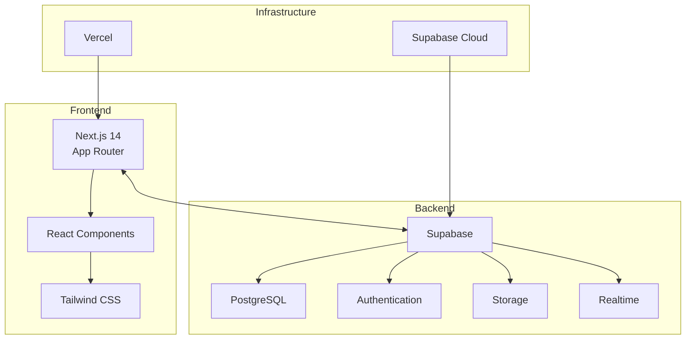
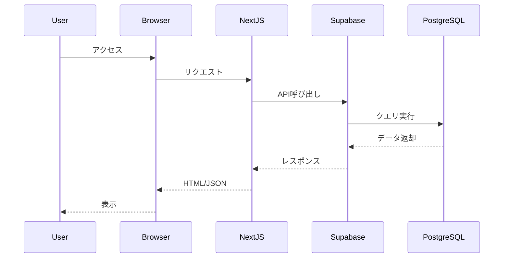

# システムアーキテクチャ概要

最終更新: 2025-07-28

## システム構成

DevMemoは、モダンなフルスタック技術を活用した技術ブログCMSです。

## アーキテクチャの特徴

### 1. サーバーレスアーキテクチャ
- フロントエンド: Vercelでホスティング
- バックエンド: Supabaseによるマネージドサービス
- スケーラビリティと可用性を自動で確保

### 2. モノレポ構成
- フロントエンドとバックエンドを単一リポジトリで管理
- 開発効率とコードの一貫性を向上

### 3. 型安全性
- TypeScriptによる完全な型定義
- Supabaseの型生成機能を活用

## データフロー

## セキュリティアーキテクチャ

### 認証・認可
1. **Supabase Auth**
   - JWT based authentication
   - セッション管理
   - ソーシャルログイン対応

2. **Row Level Security (RLS)**
   - データベースレベルでのアクセス制御
   - ユーザーごとのデータ分離

### データ保護
- HTTPS通信の強制
- 環境変数による機密情報管理
- CSRFトークンによる保護

## パフォーマンス最適化

### フロントエンド
- Next.js App Routerによるサーバーコンポーネント
- 画像最適化（next/image）
- コード分割とレイジーローディング

### バックエンド
- データベースインデックスの最適化
- 全文検索機能の実装
- キャッシュ戦略の活用

## 監視・運用

### ログ管理
- Vercelのログ機能
- Supabaseのダッシュボード

### エラートラッキング
- クライアントサイドエラーの収集
- APIエラーレートの監視

## 今後の拡張性

1. **マイクロサービス化**
   - 必要に応じて機能を分離可能
   - APIゲートウェイの導入

2. **国際化対応**
   - i18nサポートの追加
   - 多言語コンテンツ管理

3. **AI機能統合**
   - コンテンツ推薦
   - 自動タグ付け