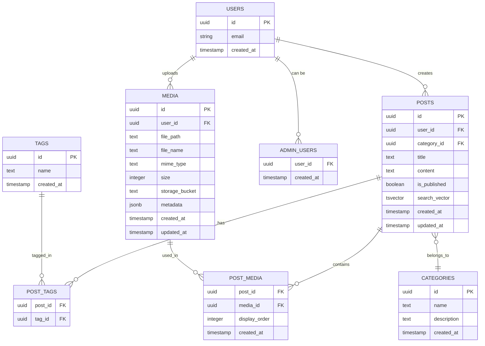

# データベーススキーマ設計

最終更新: 2025-07-28

## ER図



## テーブル詳細

### auth.users (Supabase Auth)
Supabaseの認証システムが管理するユーザーテーブル

| カラム | 型 | 説明 |
|--------|-----|------|
| id | uuid | ユーザーID（主キー） |
| email | varchar | メールアドレス |
| created_at | timestamptz | 作成日時 |

### public.posts
ブログ記事を管理するメインテーブル

| カラム | 型 | NULL | デフォルト | 説明 |
|--------|-----|------|------------|------|
| id | uuid | NO | uuid_generate_v4() | 記事ID |
| user_id | uuid | YES | - | 作成者ID |
| category_id | uuid | YES | - | カテゴリID |
| title | text | NO | - | 記事タイトル |
| content | text | YES | - | 記事本文 |
| is_published | boolean | NO | false | 公開フラグ |
| search_vector | tsvector | YES | - | 全文検索用ベクトル |
| created_at | timestamptz | NO | now() | 作成日時 |
| updated_at | timestamptz | NO | now() | 更新日時 |

**インデックス:**
- `idx_posts_category_id` (category_id)
- `idx_posts_user_id` (user_id)
- `posts_search_idx` (search_vector) - GINインデックス

### public.categories
記事のカテゴリを管理

| カラム | 型 | NULL | デフォルト | 説明 |
|--------|-----|------|------------|------|
| id | uuid | NO | uuid_generate_v4() | カテゴリID |
| name | text | NO | - | カテゴリ名 |
| description | text | YES | - | カテゴリ説明 |
| created_at | timestamptz | NO | now() | 作成日時 |

### public.tags
記事のタグを管理

| カラム | 型 | NULL | デフォルト | 説明 |
|--------|-----|------|------------|------|
| id | uuid | NO | uuid_generate_v4() | タグID |
| name | text | NO | - | タグ名 |
| created_at | timestamptz | NO | now() | 作成日時 |

### public.post_tags
記事とタグの多対多リレーション

| カラム | 型 | NULL | 説明 |
|--------|-----|------|------|
| post_id | uuid | NO | 記事ID |
| tag_id | uuid | NO | タグID |

**制約:**
- 複合主キー: (post_id, tag_id)
- 外部キー: posts(id) ON DELETE CASCADE
- 外部キー: tags(id) ON DELETE CASCADE

**インデックス:**
- `idx_post_tags_post_id` (post_id)
- `idx_post_tags_tag_id` (tag_id)

### public.media
アップロードされたメディアファイルの管理

| カラム | 型 | NULL | デフォルト | 説明 |
|--------|-----|------|------------|------|
| id | uuid | NO | uuid_generate_v4() | メディアID |
| user_id | uuid | YES | - | アップロードユーザーID |
| file_path | text | NO | - | ファイルパス |
| file_name | text | NO | - | ファイル名 |
| mime_type | text | NO | - | MIMEタイプ |
| size | integer | NO | - | ファイルサイズ（バイト） |
| storage_bucket | text | NO | 'media' | ストレージバケット |
| metadata | jsonb | NO | '{}' | メタデータ |
| created_at | timestamptz | NO | now() | 作成日時 |
| updated_at | timestamptz | NO | now() | 更新日時 |

**インデックス:**
- `idx_media_user_id` (user_id)
- `idx_media_created_at` (created_at)

### public.post_media
記事とメディアの関連

| カラム | 型 | NULL | デフォルト | 説明 |
|--------|-----|------|------------|------|
| post_id | uuid | NO | - | 記事ID |
| media_id | uuid | NO | - | メディアID |
| display_order | integer | NO | 0 | 表示順序 |
| created_at | timestamptz | NO | now() | 作成日時 |

**制約:**
- 複合主キー: (post_id, media_id)
- 外部キー: posts(id) ON DELETE CASCADE
- 外部キー: media(id) ON DELETE CASCADE

**インデックス:**
- `idx_post_media_post_id` (post_id)
- `idx_post_media_media_id` (media_id)

### public.admin_users
管理者権限を持つユーザー

| カラム | 型 | NULL | 説明 |
|--------|-----|------|------|
| user_id | uuid | NO | ユーザーID（主キー） |
| created_at | timestamptz | NO | 作成日時 |

## トリガーと関数

### update_updated_at_column()
updated_atカラムを自動更新するトリガー関数

```sql
CREATE OR REPLACE FUNCTION update_updated_at_column()
RETURNS TRIGGER AS $$
BEGIN
    NEW.updated_at = CURRENT_TIMESTAMP;
    RETURN NEW;
END;
$$ language 'plpgsql';
```

適用テーブル:
- posts
- media

### posts_search_vector_update()
全文検索用のベクトルを自動更新

```sql
CREATE OR REPLACE FUNCTION posts_search_vector_update() 
RETURNS trigger AS $$
BEGIN
  NEW.search_vector :=
    setweight(to_tsvector('english', COALESCE(NEW.title, '')), 'A') ||
    setweight(to_tsvector('english', COALESCE(NEW.content, '')), 'B');
  RETURN NEW;
END;
$$ LANGUAGE plpgsql;
```

### check_storage_quota()
ユーザーのストレージ使用量をチェック

```sql
CREATE OR REPLACE FUNCTION check_storage_quota()
RETURNS trigger AS $$
DECLARE
  user_quota integer := 104857600; -- 100MB
  current_usage integer;
BEGIN
  SELECT COALESCE(SUM(size), 0) INTO current_usage
  FROM media
  WHERE user_id = NEW.user_id;

  IF (current_usage + NEW.size) > user_quota THEN
    RAISE EXCEPTION 'Storage quota exceeded';
  END IF;

  RETURN NEW;
END;
$$ language plpgsql security definer;
```

## Row Level Security (RLS) ポリシー

### posts テーブル
- **読み取り**: 公開記事は全員、非公開は作成者のみ
- **作成/更新/削除**: 作成者のみ

### categories / tags テーブル
- **読み取り**: 全員
- **作成/更新/削除**: 管理者のみ

### media テーブル
- **読み取り**: 全員
- **作成/更新/削除**: アップロードユーザーのみ

### post_tags / post_media テーブル
- **読み取り**: 全員
- **作成/更新/削除**: 記事の作成者のみ